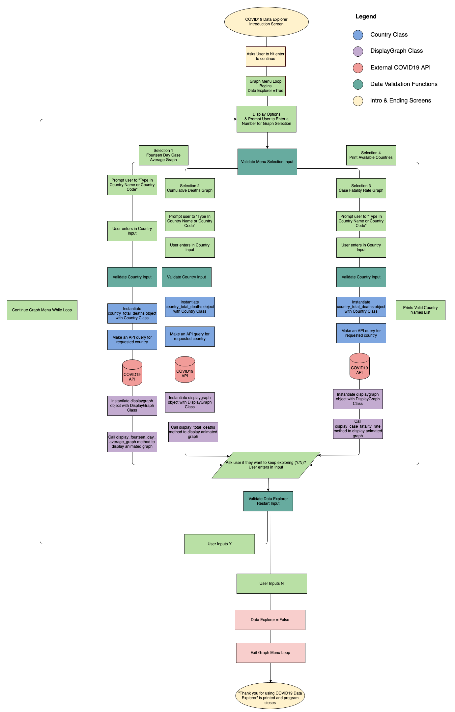

# COVID19 Data Explorer

A Python data visualisation tool to explore the latest COVID19 data. 
Developed by Gabriel Wong for his Coder Academy Term 2 Final Assignment.

### Application Features

- Explore a country's 14 day case average, cumulative deaths and case fatality rate, via an animated graph.
- Utilises an up to date covid19api.com API, created by Kyle Redelinghuys. This API takes its data from Johns Hopkins CSSE. 
- Uses OOP to store the API data
- Implements Automated testing using Python's built-in Unittest module
- Developed a CI/CD pipeline

## Instructions and Help

### System Requirements

In order to run this application, the user will preferably be running on a *nix based operation system (i.e. MacOS or Linux). However, Windows is supported due to the cross-platform nature of Python 3 but was not tested on.

### Python 3

The application requires Python 3 to be installed on your machine. To check if it is installed, you can enter the following command:

```
$ which python3
```
or

```
$ python3 --version
```

If you need to install Python 3, you can download the latest Python 3 version at [https://www.python.org/downloads/](https://www.python.org/downloads/ "https://www.python.org/downloads/").


### Clone the git repository on your computer.
```
$ git clone https://github.com/GabrielWongAu/covid19-data-explorer.git
```

You can also download the entire repository as a zip file and unpack it on your computer if you do not have git.

After cloning the repository, you need to change directory into the new covid19-data-explorer directory.
```
$ cd covid19-data-explorer
```


### Setting up a virtual environment (optional)

It is recommended to create a virtual environment to contain the application's dependencies in the one folder. This can be done by running the following command:

```
$ python3 -m venv venv
```

To activate the virtual environment, run the following command:
```
$ source venv/bin/activate
```

Note: Once you have finished with the COVID19 Data Explorer application, you can deactivate the virtual environment by running the following command:
```
$ deactivate
```
### Install Dependencies

The plotille, replit and requests modules will need to be installed before running the application. They can be installed by running the following commands in your terminal:

```
pip install plotille
pip install replit
pip install requests
```

Alternatively, you can install all the dependencies by running the following command (run in the covid19-data-explorer folder):

```
pip install -r requirements.txt
```

### Run the program

Run the program by running the following command

```
python src/main.py
```


### Application Information

Inspired by Our World in Data’s Data Explorer, I have created a COVID19 Data Explorer terminal application. My application is a data visualisation tool to help see the trends in 14 day case averages, cumulatives deaths and case fatality rates. 

I decided to use Plotille, a Python graph module, as it provides an amazing UI experience to display graphs in the terminal.
	
### What problems your project solves

Problem statement: COVID19 continues to spread across the world due to its high transmissibility. It is a global problem in which we all need to play out part in containing the virus. The solution to this problem is for case numbers to decline and eventually get to zero (best case scenario).

### Why did you build this?

I built this application to allow people to keep up to date with the latest COVID19 data. I wanted to create an application that would provide insights into the COVID19 pandemic and allow people to see the current trends that are playing out. I believe self-awareness is key for people to take action and to halt the spread of the virus. 


### How input and output will be handled

At the menu selection screen, users will enter in a number between 1 to 4 to choose which graph they want to view. Option 1-3 are graphs, while option 4 displays the available countries.  The user will only proceed to the menu screen if they input a valid number (1-4). I have done this by creating a validate menu selection function which checks for a valid number input. If it’s a valid number input (1-4), it will return the number. Otherwise it will return False.

Once they have inputted a valid number, they will proceed to type in a Country or Country code. The user will only proceed to the display graph when they have entered in a valid Country name or Code. I have done this by creating a validate menu selection function which sanitises the data and checks whether the sanitised input matches a list of available countries/country codes.

Once the country input has been validated, it will attempt to complete a Python Requests get request to https://api.covid19api.com/. If there is a HTTP ConnectionError, the error will be handled gracefully. It will explain to the user that it is “Unable to connect to https://api.covid19api.com/total/dayone/country/{valid_country_input}”. It will then say there is a Requests Connection Error and advise the user to check their internet connection.


### How the solution will be structured in terms of classes, functions and other entities
My application is orchestrated by a graph menu while loop. It allows the user to select which graph they want to explore, or which countries are available to display. Once a graph is chosen and animated, the user can exit the program gracefully if they choose to do so.  

My program utilises two classes (country and display graph). The country class is used to parse the data from the API and get the data ready for the plotille graph. The displaygraph class is used to create the plotille graph and animate the data.  

I have 4 separate menu selection functions, which are called depending on which menu is selected.

I use validator functions to validate input (menu selection, country selection and keep exploring prompt).


### Python Dependencies required

*	Requests – an elegant and simple HTTP library for Python, built for human beings. 
    * I have used the Python Requests module to make API get requests.
*	Json – a built-in Python package that works with JSON data.
    *	I have used the json module to decode the JSON data from the API requests.
*	Os – Python’s built in miscellaneous operating system interfaces 
    *	Sys and os have been used to print to the centre of the screen.
*	Plotille – plot in the terminal using braille dots.
    *	Used to plot the COVID19 data in a terminal graph.


### Control Flow Flowchart

 
